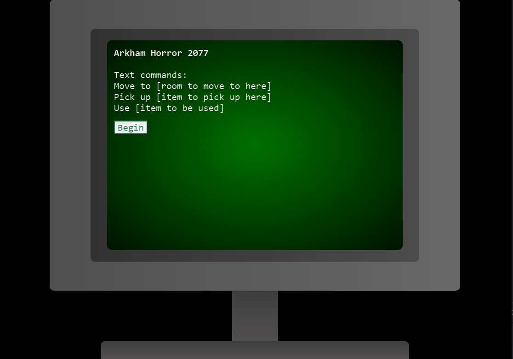

# Arkham Horror

#### By _**Liam Campbell, Ben Goodrow, PJ Perry, Peter Vang**_

#### _This is a simple RPG game._

## Technologies Used

* Babel
* Bootstrap
* clean-webpack-plugin
* CSS
* css-loader
* enlist
* file-loader
* html-loader
* html-webpack-plugin
* JavaScript
* Jest
* jQuery
* Node Package Manger
* popper
* style-loader
* webpack-cli
* webpack-dev_server
* dotenv-webpack

## Description
_This is a RPG where players moves through rooms of the house via text commands. In certain rooms there are items to be picked up to advance the story. Upon arrival in the last room the player must fight a monster to advance to the final part of the story and win the game._

## Setup/Installation Requirements

* Clone this repository to your desktop
* in terminal console git clone https://github.com/lcmpbll/Arkham-Horror
* Navigate to the top level of the directory
* in terminal console cd Arkham-Horror
* Recreate the project and installation of dependencies require to be download.
* in terminal console npm install
* Create production environment.
* in terminal console npm run build
* Open project in development server in the browser.
* in terminal console npm run start

## Known Bugs

* _No known bugs_

## License

Copyright](LICENSE) (c) _07/06/2022_ _Liam Campbell Ben Goodrow PJ Perry Peter Vang_
## Contact Information

Feel free to reach out to us via github:  
[Liam's github](https://github.com/lcmpbll)
[Ben's github](https://github.com/bpgoodrow)
[Pj's github](https://github.com/Jamesp92)
[Peter's github](https://github.com/vangpeter06)